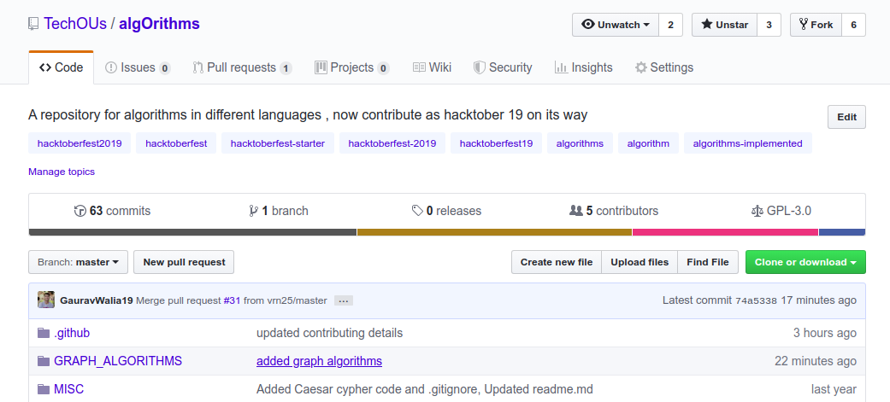
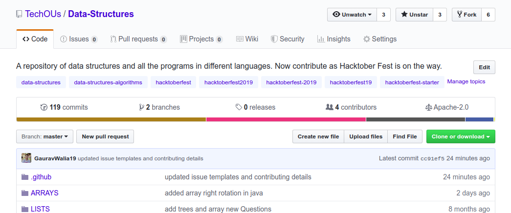
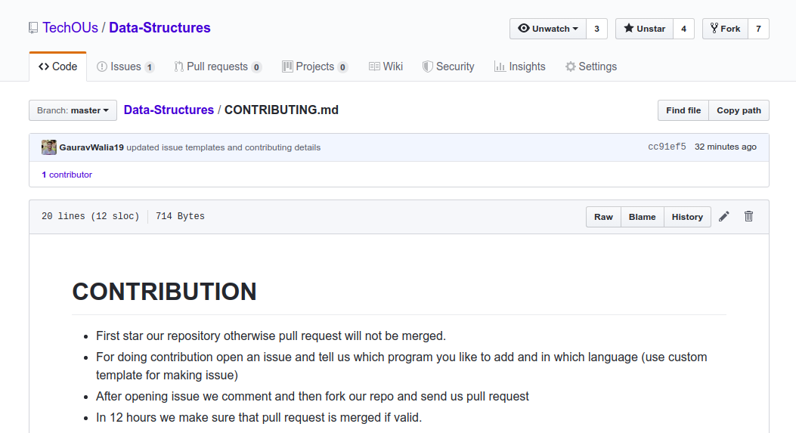

# HACKTOBER FEST 2019

Welcome guys TechOus is supporting **Open Source Contribution** as Hacktober Fest 2019 is going on and you can earn a **limited edition T-shirt** from Digital Ocean.

Follow the steps for a good Open Source Contribution as this year some guidelines are changed **now adding just a name will not be counted by Digital Ocean**.

Here are some of the repostories you can choose but you can choose any other also

## 1. [ALGORITHMS](https://github.com/TechOUs/algOrithms)

## 2. [DATA STRUCTURES](https://github.com/TechOUs/Data-Structures)

* Fork the repository you like
* Read its README and find **CONTRIBUTING file** in the repository

* Read all the instructions carefully and follow

ACCEPT MY HACKTOBER FEST REQUEST